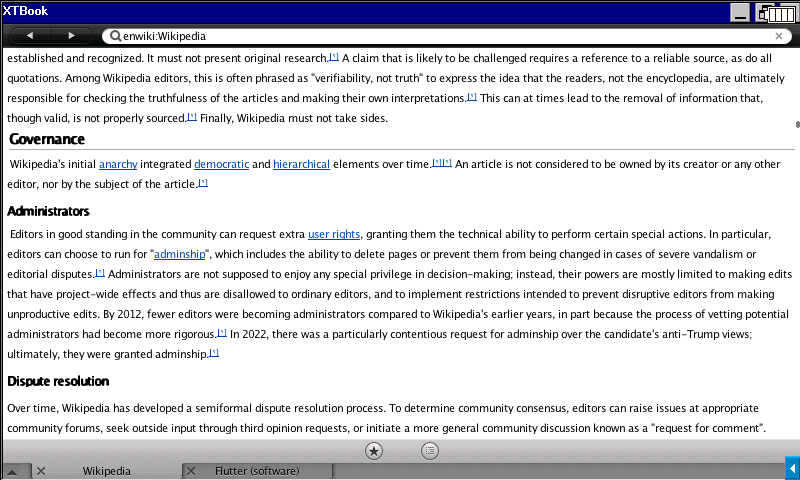
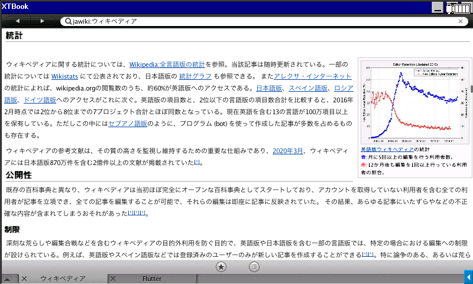

# XTBook: MediaWiki Viewer for Sharp Brain

 
© Wikipedia "[Wikipedia](https://en.wikipedia.org/wiki/Wikipedia)" - [CC BY-SA 4.0](https://creativecommons.org/licenses/by-sa/4.0/)

[XTBook](https://web.archive.org/web/20240117022807/http://www.nexhawks.net/) is a piece of software developed by [Nexhawks](https://github.com/yvt) and allows you to browse MediaWiki-based wiki sites on [SHARP Brain](https://jp.sharp/edictionary/) series electronic dictionaries, Windows PCs, Linux, and Mac. It supports Wikiplexus formatted data generated from a dump file of a MediaWiki-based wiki site and Image-Complex formatted data generated from image files. Also, XTBook can search articles in a second from more than 1,000,000 keys by using a searching database embedded in XTBook Wikiplexus.

**Concepts**

- Processes a wiki site in the same procedure as Wikipedia as much as possible
- Prioritizes processing accuracy
- Supports JPEG and HTML

## How To Use Our Dictionary Files

Download desired wikis from [Releases](../../releases), and follow instructions at [our project wiki (Japanese)](../../wiki). You can also learn how to make dictionary files by yourself there.

## How To Obtain the XTBook Itself

You can download the original distribution by Nexhawks [here](https://github.com/yvt/xtbook/releases). Also, I made another version with small fixes such as avoiding the usage of `gets()` and updating libraries [here](https://github.com/watamario15/xtbook/releases/tag/v0.2.7). Mac (x86 32-bit) version is only on the original release, and Linux (x86/Arm 64-bit) version is only on my release.

## Previous Repository at OSDN

In response to the OSDN discontinuation, we moved the distribution site of dictionary files to this GitHub repository. You can still download old files from mirrors:

**JAIST**

- Release: <https://ftp.jaist.ac.jp/pub/osdn.net/xtbook/>
- Storage: <https://ftp.jaist.ac.jp/pub/osdn.net/storage/g/x/xt/xtbook/>

**IIJ**

- Release: <https://ftp.iij.ad.jp/pub/osdn.jp/xtbook/>
- Storage: <https://ftp.iij.ad.jp/pub/osdn.jp/storage/g/x/xt/xtbook/>

## Images

You can use [jawikiimg-20190730.xtbdict.7z](https://ftp.iij.ad.jp/pub/osdn.jp/storage/g/x/xt/xtbook/WikipediaImage/20190730/jawikiimg-20190730.xtbdict.7z) for Japanese Wikipedia. For other wiki sites, you may find an image distribution in an older release.

## Licenses

Refer to the bottom of [our project wiki](../../wiki) or [our web page](https://watamario15.github.io/xtbook/). Note that images contain files that are under a different license, as described [here](https://dumps.wikimedia.org/legal.html) for Wikipedia.

---

# 【XTBook】SHARP Brain 用 MediaWiki ビューア

 
© Wikipedia "[ウィキペディア](https://ja.wikipedia.org/wiki/%E3%82%A6%E3%82%A3%E3%82%AD%E3%83%9A%E3%83%87%E3%82%A3%E3%82%A2)" - [CC BY-SA 4.0](https://creativecommons.org/licenses/by-sa/4.0/)

[XTBook](https://web.archive.org/web/20240117022807/http://www.nexhawks.net/) は [Nexhawks 氏](https://github.com/yvt)が[電子辞書 SHARP Brain](https://jp.sharp/edictionary/)、Windows PC、Linux、Mac で MediaWiki を可能な限り原版に忠実な形で表示するために開発したアプリケーションです。MediaWiki のダンプデータを変換して生成される、XTBook Wikiplexus 形式及び画像を変換した Image Complex 形式のデータベースに対応します。 また、XTBook Wikiplexus に内蔵された検索データベースを利用し、1,000,000 件以上のキーから高速に検索をすることができます。

**コンセプト**

- 可能な限り通常の Wikipedia と同じ手順で処理する
- 処理精度を優先する
- JPEG と HTML をサポートする

## 配布辞書ファイルの使い方

欲しい wiki のデータを [Releases](../../releases) からダウンロードしたのち、[このプロジェクトの wiki](../../wiki) の説明に従ってください。この wiki では、辞書ファイルの自作方法も扱っています。

## XTBook 本体の入手方法

Nexhawks 氏の公式版は[こちら](https://github.com/yvt/xtbook/releases)から入手できます。私が `gets()` の回避、ライブラリの更新などの微細な変更を行った版は[こちら](https://github.com/watamario15/xtbook/releases/tag/v0.2.7)から入手できます。Mac (x86 32-bit) 版は公式リリース、Linux (x86/Arm 64-bit) 版は私のリリースのみで提供されています。

## 旧 OSDN リポジトリ

OSDN のサービス終了を受け、XTBook 辞書ファイルの配布を本 GitHub リポジトリに完全移行しました。以前のファイルは、以下のミラーサイトからダウンロードしてください。

**JAIST**

- Release: <https://ftp.jaist.ac.jp/pub/osdn.net/xtbook/>
- Storage: <https://ftp.jaist.ac.jp/pub/osdn.net/storage/g/x/xt/xtbook/>

**IIJ**

- Release: <https://ftp.iij.ad.jp/pub/osdn.jp/xtbook/>
- Storage: <https://ftp.iij.ad.jp/pub/osdn.jp/storage/g/x/xt/xtbook/>

## 画像データ

日本語版 Wikipedia は [jawikiimg-20190730.xtbdict.7z](https://ftp.iij.ad.jp/pub/osdn.jp/storage/g/x/xt/xtbook/WikipediaImage/20190730/jawikiimg-20190730.xtbdict.7z) を使用してください。他の Wiki に関しては、最新版リリースに含まれていなくても古いリリースには含まれている場合があります。

## ライセンス

[プロジェクトの wiki](../../wiki) もしくは [Web サイト](https://watamario15.github.io/xtbook/) の下部を参照してください。画像については、例えば Wikipedia であれば[こちら](https://dumps.wikimedia.org/legal.html)で説明されているように、異なるライセンスの画像が含まれていることに注意してください。
